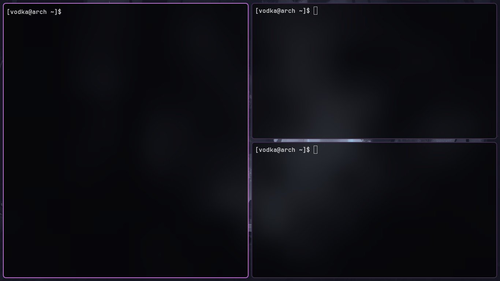
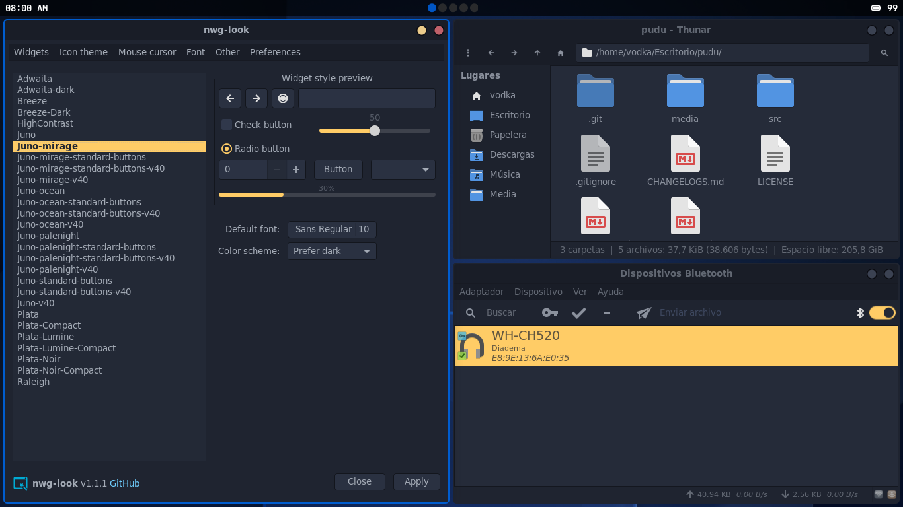
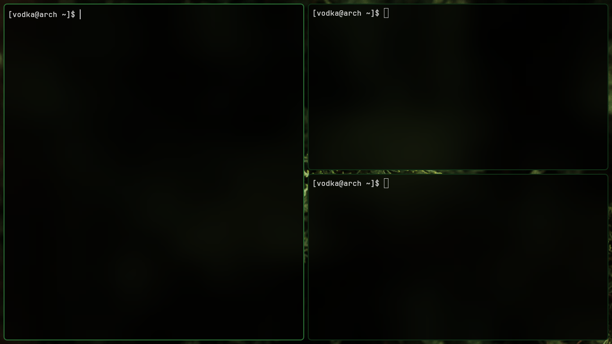

<div align="center">
  
</div>

> [!NOTE]
>🦌 **pudu** is a minimalist, lightweight tiling Wayland compositor based on wlroots, with a dash of eye candy.
>
>It's early-stage and a solo hobby project, **so bugs are part of the deal**.
>Take it easy and file an issue if something breaks.

<div align="center">



</div>

## Installation  

> [!CAUTION]
> XWayland is **not supported** and this is intentional. pudu is a pure Wayland compositor.

> [!IMPORTANT]  
> Only tested on **Arch Linux** and **Void Linux**. Other distributions may work but are untested.  

### Arch

With an **AUR helper** (`yay/paru`):

```bash
yay -S pudu-git
```
See more [here](https://aur.archlinux.org/packages/pudu-git)

### Void Linux

Install build dependencies:

```bash
sudo xbps-install -S base-devel pkg-config wayland-devel wayland-protocols wlroots0.19-devel libxkbcommon-devel cairo-devel libinput-devel pixman-devel seatd dbus mesa-dri vulkan-loader
```

For **AMD GPUs**, also install:

```bash
sudo xbps-install -S mesa-vulkan-radeon linux-firmware-amd
```

Add your user to the required groups and enable seatd and dbus:

```bash
sudo usermod -aG video,input,_seatd $USER

sudo ln -s /etc/sv/seatd /var/service/
sudo ln -s /etc/sv/dbus /var/service/
```

Clone, build, and install:

```bash
git clone https://github.com/vodkanull/pudu.git
cd pudu/src
make
sudo make install
```

The binary will be placed at `/usr/local/bin/pudu` and the desktop entry at `/usr/share/wayland-sessions/pudu.desktop`.

> [!IMPORTANT]
> On Void Linux, D-Bus does not start automatically for the user session. If you are **not using a display manager**, wrap pudu with `dbus-run-session`:
>
> ```bash
> dbus-run-session pudu
> ```

## Configuration

> [!TIP]
> - Move window: **Super** + **Left click** + drag
> - Close window: **Super** + **C**
> - Reload config: **Super** + **R** (kills autostarts, reloads config, re-runs autostarts)
> - Open terminal: **Super** + **Enter** (default: kitty, change it in the config file)
>
> The configuration file is located at **`~/.config/pudu/config`**.
>
> See an example config 👉 [here](https://github.com/vodkanull/pudu/blob/main/src/config) 👈

<div align="center">




</div>

> [!NOTE]
>  **👇 Contributing**
>
> If you find a bug, have a suggestion, or just want to share your thoughts, feel free to **open an issue**.
> Pull requests are **not accepted** (this is a personal hobby project).
>
> For a list of supported Wayland protocols see [PROTOCOLS.md](./PROTOCOLS.md).
> For the full release history see [CHANGELOGS.md](./CHANGELOGS.md).

<!--
<video src="https://github.com/user-attachments/assets/c6b639f0-cfee-4a8a-bd6e-3c1cb852b7e8" autoplay loop muted playsinline width="100%"></video>
-->


## License
🦌 Pudu is made in 🇨🇱 and is under the GPL v3.0 license.
