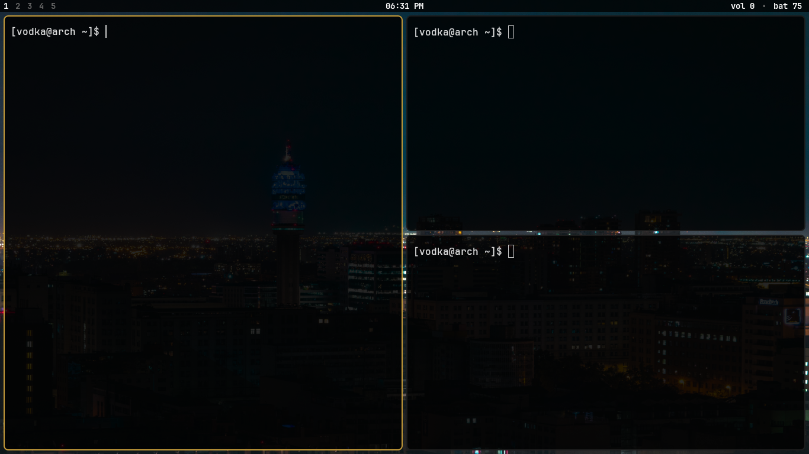

<!--<div align="center">
  
</div>-->

> [!NOTE]
> 🦌 **pudu** is a minimal tiling Wayland Compositor built on top of wlroots.
> It's just a hobby project, so take it easy.

<!--<div align="center">
  
</div>-->

<video src="https://github.com/user-attachments/assets/6f277ee5-7229-4e06-b8ca-f1c0c743a3d1" autoplay loop muted playsinline width="100%"></video>


> [!CAUTION]
> XWayland is **not supported** and this is intentional. pudu is a pure Wayland compositor.

> [!IMPORTANT]
> Only tested on **Arch Linux**. Other distributions may work but are untested.

## Dependencies

Before building, install the required packages:

```bash
sudo pacman -S base-devel git wlroots0.19 wayland libxkbcommon libinput
```

## Building from source

```bash
git clone https://github.com/vodkanull/pudu.git
cd pudu/pudu
make
sudo cp build/pudu /usr/local/bin/
```

> [!NOTE]
> The configuration is read from `~/.config/pudu/config`. If the file does not exist, **pudu creates it automatically**.

> [!NOTE]
> The default keybind `Super + Enter` opens **kitty**. If kitty is not installed, nothing will happen. You can change this in your config.

> [!TIP]
> 🦌 You can see an example of the configuration file 👉 [here](https://github.com/vodkanull/pudu/blob/main/pudu/config) 👈.

## License
pudu is licensed under the [GPL v3.0](LICENSE) license.
